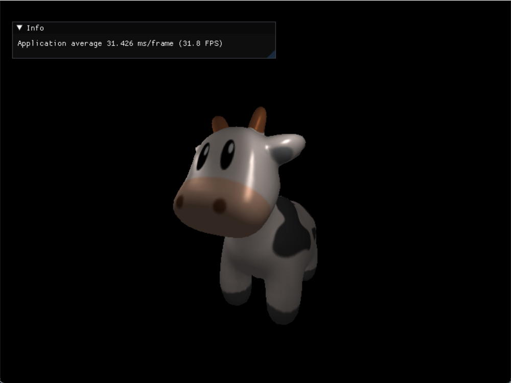

# MGL - 软光栅器

这是一个学习项目，为了更好的理解渲染流水线。

光栅化的核心代码在src/core/impl/graphics.cpp中。

通过继承Shader类，重写fragment_shader和vertex_shader来实现可编程shader。

## 使用的坐标系

世界空间和观察空间为右手坐标系，相机朝向为z轴负方向；

齐次空间和NDC为左手系；

屏幕坐标系左下角为(0, 0)，高为y轴，宽为x轴。

## 如何使用

使用了预编译的SDL2和imgui库。SDL2需要安装运行时环境。所有的库都是在window下使用mingw编译器编译，因此只支持window环境。

`make`（或`mingw32-make`）可以编译所有src/demo下的所有示例。`make <文件名>`可以指定编译src/test中的示例。

## Feature

+ 视口剔除
+ 自定义shader
+ 双线性插值采样纹理

## Demo

## Todo

- [ ] 添加直线模式
- [x] 添加线框模式
- [x] 支持framebuffer
- [ ] 添加demo：shadow map
- [ ] 实现mipmapping
- [ ] 添加几何着色器、曲面细分着色器
- [x] 实现鼠标交互，场景漫游
- [ ] 多线程支持

## 参考

在参考了[大佬的项目](https://github.com/zauonlok/renderer.git)后，仿照其项目结构大幅重构了项目，将光栅化和后端分离开来。
